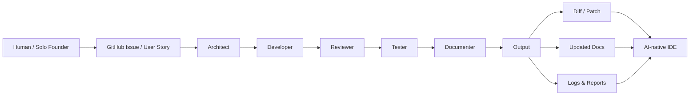

# Architecture Overview

## High-Level Workflow

Mermaid source (editable)

```mermaid
flowchart LR
    Human[Human / Solo Founder]
    Issue[GitHub Issue / User Story]

    Human --> Issue
    Issue --> Architect
    Architect --> Developer
    Developer --> Reviewer
    Reviewer --> Tester
    Tester --> Documenter
    Documenter --> Output

    Output --> Patch[Diff / Patch]
    Output --> Docs[Updated Docs]
    Output --> Logs[Logs & Reports]

    Patch --> IDE[AI-native IDE]
    Docs --> IDE
    Logs --> IDE

```

